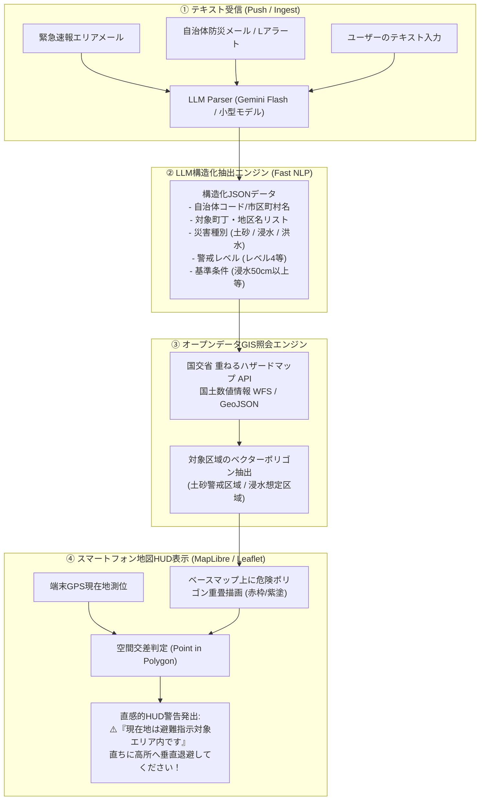

# 避難指示リアルタイムマップ化DX（EvacuationMap DX）要件定義・アーキテクチャ仕様書

## 1. 開発背景と問題意識（台風25号被災実証からの教訓）

### 1.1 「キキクル」と「自治体避難指示」の断絶
2026年台風25号（ドゥージェン）の被災実録データ分析において、情報伝達システムにおける致命的な構造的欠陥が浮き彫りとなった。

* **気象庁「キキクル」の特性**:
  * 1kmメッシュの地図上で「紫（危険・レベル4相当）」がリアルタイム（10分更新）に可視化され、直感的な把握が可能。
  * しかし、キキクルは自然現象の客観的指標であり、法的避難を強制・勧告するものではない。また都市内水氾濫では大雨特別警報基準（50年に1度）により「黒メッシュ」が出現しない構造的盲点がある。
* **自治体「避難指示」の特性**:
  * 災害対策基本法第60条に基づく法的権限を持ち、住民に退避を命じる最高度の行政情報。
  * しかし、配信形態が**「緊急速報メール（エリアメール）」や「Lアラート」のテキスト（文字情報）**に限定されている。

### 1.2 「文字情報トラップ」による認知破綻
* **外出者・観光客の地理的迷子**:
  * 自治体メールは「○○地区、△△町の急傾斜地崩壊危険箇所・土砂災害警戒区域等」と文章で配信される。
  * 土地鑑のない旅行者、出張者、外国人インバウンドは、**「今自分が立っている場所がその対象区域なのか」を瞬時に判断することが原理的に不可能**。
* **現地実録での実例**:
  * 12:32、横浜市中区山下町（中華街・標高約2mの平地）で食事中に「中区の土砂災害警戒区域に避難指示」を受信。
  * 背後わずか250mにそびえる山手町台地（標高35mの崖地）の危険を平地から直感することは困難であり、地理的位置関係の把握に迷いが生じた。
* **結論**:
  * 「文字を読ませて考えさせる防災」は、極限状態の外出先では機能しない。
  * **「届いたテキストを即座に地図ポリゴンへ変換し、現在地ピンと重ねて赤枠表示するDXツール」**が不可欠である。

---

## 2. システム概要とコアコンセプト

### 2.1 コンセプト
> **「文字の壁」を突破する。テキストの避難指示を1秒で地図ポリゴンへ。**  
> 自治体のシステム改修を一切待たずに、受信端末側（Web / アプリ）で既存のテキスト速報を空間情報へ逆引き変換する。

### 2.2 システムアーキテクチャ概要


---

## 3. 主要機能要件

### 3.1 機能 1: テキスト速報の自動構造化（LLM Parser）
* **入力**: エリアメール本文、LアラートJSON/XML、またはユーザーによる貼り付けテキスト。
* **出力**: 厳格なスキーマを持つ構造化JSON。
```json
{
  "issuing_authority": "横浜市中区",
  "alert_level": 4,
  "alert_type": "避難指示",
  "disaster_types": ["landslide"],
  "target_areas": [
    {
      "district": "山手町",
      "hazard_condition": "急傾斜地崩壊危険箇所・土砂災害警戒区域"
    },
    {
      "district": "元町",
      "hazard_condition": "急傾斜地崩壊危険箇所・土砂災害警戒区域"
    },
    {
      "district": "石川町",
      "hazard_condition": "急傾斜地崩壊危険箇所・土砂災害警戒区域"
    }
  ],
  "effective_time": "2026-09-21T12:32:00+09:00",
  "action_required": "立ち退き避難、または高所への垂直退避"
}
```

### 3.2 機能 2: 国土交通省オープンデータ連動（GISポリゴン生成）
* **データソース**:
  * 国土交通省「重ねるハザードマップ」タイル・API（土砂災害警戒区域、洪水浸水想定区域、高潮浸水想定区域）
  * 国土数値情報（A33: 土砂災害警戒区域データ、A31: 浸水想定区域データ）
  * 自治体オープンデータGIS（横浜市行政地図情報システム等）
* **処理**:
  * 抽出された町丁名と自治体コードに基づき、該当バウンディングボックス内の危険区域GeoJSONを取得。

### 3.3 機能 3: 現在地判定とビジュアルHUD警告
* **空間内外判定**:
  * 端末のGPS座標（緯度・経度）が抽出されたポリゴンの内側にあるか（Point-in-Polygon）を計算。
  * 内側にある場合：**「🚨 危険区域直撃：直ちに安全な建物2階以上へ垂直退避」**
  * 近接（半径500m以内）にある場合：**「⚠️ 危険区域近接：頭上・足元の斜面や水路に警戒」**
  * 外側にある場合：**「ℹ️ 現在地は避難指示区域外ですが、周囲の状況に注意」**

---

## 4. プロトタイプ実装仕様（スタンドアロンWeb版）

### 4.1 技術スタック
* **Frontend**: Single File HTML5 + Tailwind CSS + Vanilla JS
* **Map Engine**: Leaflet.js（OpenStreetMap / 地理院タイル）
* **Geometry Processing**: Turf.js（Point-in-Polygon、バッファ計算）
* **LLM Mock / API**: クライアントサイドでのルールベース解析＋Gemini API連携対応

### 4.2 プリセットシナリオ（台風25号実録対応）
1. **シナリオ A: 横浜市中区 12:32 土砂災害避難指示**
   * テキスト: 「【警戒レベル4】避難指示発令。横浜市中区の土砂災害警戒区域等（山手町・元町・石川町・北方町等の急傾斜地近傍）に避難指示を発令しました。崖や斜面から離れて安全を確保してください。」
   * 判定: 中華街ピン（山下町）は平地だが、背後250mの山手町崖地ポリゴンが真っ赤に点滅し「近接警戒」を表示。
2. **シナリオ B: 横浜市中区 14:23 内水氾濫・都市浸水避難指示**
   * テキスト: 「【警戒レベル4】避難指示。中区本牧・山下町・元町周辺の低地および浸水想定区域（浸水深0.5m以上）を対象に避難指示を発令。道路冠水・下水逆流が発生中。屋外移動は危険です。建物の2階以上へ垂直退避してください。」
   * 判定: 中華街ピンが赤枠ポリゴン直撃となり、「🚨 直ちに2階以上へ垂直退避！」を大画面アラート表示。

---

## 5. フォーク先開発用プロンプト（別チャット展開用）

別セッションまたはフォークしたチャットで本格的なアプリケーション（Next.js / FastAPI / React Native / PWA）を開発する際は、以下のプロンプトをそのまま入力してください。

```markdown
# 避難指示リアルタイムマップ化DX（EvacuationMap DX）開発プロンプト

## 目的
自治体の緊急速報メール（エリアメール）やLアラートから届く「テキスト形式の避難指示文」をLLMで即座に解析し、国交省ハザードマップのオープンデータと突合して、ユーザーのスマートフォン地図上に「避難指示対象エリア（危険ポリゴン）」と「現在地ピン」を重ね合わせて直感判定するWebアプリケーション（PWA）を開発してください。

## コア要件
1. **テキスト構造化パイプライン**:
   - 避難指示テキストから【自治体名・対象町丁字・災害種別（土砂/浸水/洪水）・警戒レベル・避難条件】を抽出するParser（Gemini Flash APIまたはローカルNLP）。
2. **マップ可視化エンジン**:
   - MapLibre GL JS または Leaflet を用い、国交省「重ねるハザードマップ」タイルや国交省APIから取得した危険区域GeoJSONを重畳描画。
3. **現在地内外判定（Point-in-Polygon）**:
   - スマホGPSの緯度経度を取得し、危険ポリゴンとの内外判定を実施。
   - 内側なら「🚨 避難指示対象エリア直撃・即時退避」、近傍なら「⚠️ 近接警戒」のHUD警告を表示。
4. **台風25号検証用プリセット**:
   - 横浜市中区12:32土砂避難指示、14:23内水浸水避難指示をワンクリックでテストできるUIを用意。

まずは動作するプロトタイプ（Vite + React または 単一HTML/JS）から実装を進めてください。
```
